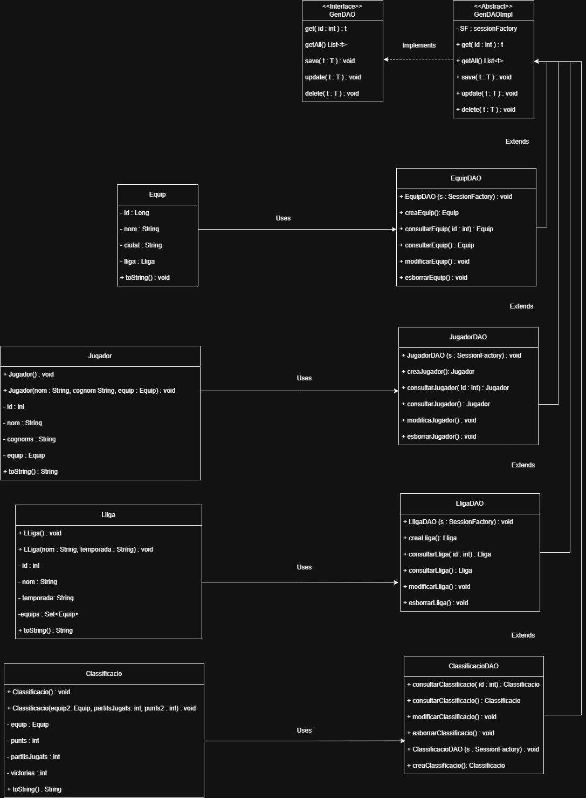

## Patró DAO

### De quina lògica d’aplicació s’encarrega el Patró DAO?
El Patró DAO s'encarrega de gestionar l'accés a les dades, actuant com una capa intermèdia entre l'aplicació i la base de dades. Aquesta capa permet aislar la lògica de persistència de dades de la lògica de negoci, facilitant així el manteniment i l'evolució del codi.

### Per què considereu que és útil el patró DAO i en què us ha servit?
El patró DAO és útil perquè permet una separació de responsabilitats dins del codi.
Facilita la separació del codi específic per a la persistència de dades de la lògica del negoci.
Això fa que el codi sigui més net i fàcil de mantenir
En el meu cas, m'ha servit per estructurar millor el projecte i assegurar-nos que cada part del codi té una funció clara.

### Heu hagut de fer cap ajust al vostre codi d’aplicació?
Sí, hede fer diversos ajustos a les classes DAO per implementar el GenDAO a totes elles. Aquest canvi ha requerit una revisió completa de les classes per assegurar-nos que totes segueixen el mateix patró i aprofiten les funcionalitats del GenDAO.

D'altra banda, he simplificat significativament el codi del main. Alguns dels canvis més destacats inclouen:
- Per fer el main més llegible, he decidit traslladar totes les preguntes necessàries per fer les operacions CRUD als mètodes DAO, creant així els mètodes Quest. Això ha permès que el codi del main sigui més net i fàcil de seguir.
- Hem possibilitat realitzar totes les operacions CRUD utilitzant el GenDAOImpl, el que ha reduit considerablement la quantitat de codi al main i al projecte en general. Aquesta reutilització dels mètodes DAO per a cada entitat ha millorat l'eficiència i la mantenibilitat del codi.

En resum, aquests ajustos han ajudat a millorar organització del codi i han facilitat el treball amb les dades dins del meu projecte.
### Diagrama de Clasases:
