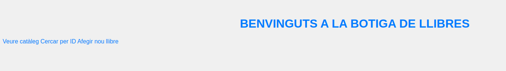
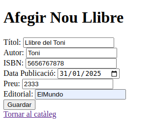
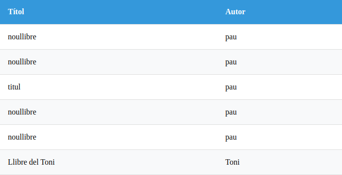
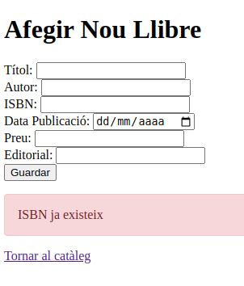
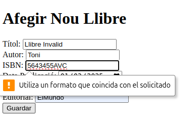
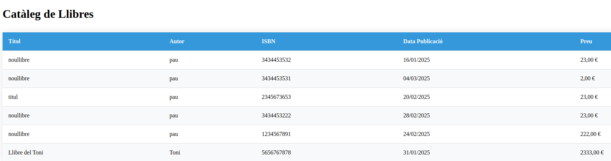
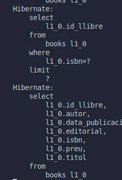

# README de l'Aplicació Botiga de Llibres 

Aqui tens la documentació bàsica de les **probas** realitzades i la contestacio a les preguntes

## Proves Realitzades  
- **Inserció de llibres**:  
  - Prova amb ISBN vàlid (10 o 13 dígits)

  - Prova amb ISBN repetit

  
  - Prova amb ISBN invàlid

  - Vista Dels Llibres
  
  - Logs
  

## Preguntes de Reflexió  

### a. Per què al servei s'usen mètodes no declarats al repositori?
Els mètodes com save() o findById() venen de Spring Data JPA El repositori hereda d'interfícies com CrudRepository, que ja els té definits.

### b. Diferenciass entre CrudRepository, PagingAndSortingRepository i JpaRepository?  
- **CrudRepository**: Fa les operacions Crud estudiaades.
- **PagingAndSortingRepository**: Agrega la paginacio
- **JpaRepository**: Directament te la paginacio i el crud.

### c. Què és Optional<Classe>?  
Simlement es per fer posible que un objecte existequi o no en cas de que existesqui desarrolli una acccio i si no no peta.
